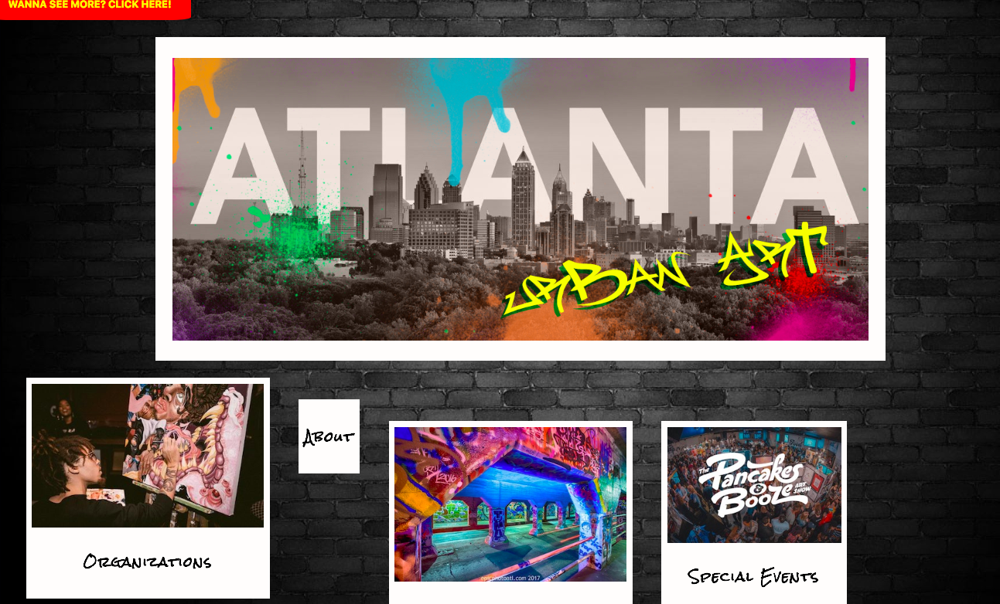
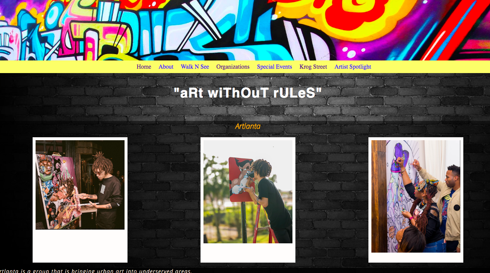

# UrbanArt
Basic website made for a final project in Codebridge Program. I chose to do a site about art since it is a passion of mine. The site shows grafitti throughtout the city of Atlanta as well as art events going on in the city.
## Screenshots of Site

## Technologies Used
1. HTML
2. CSS
## Lessons Learned
I learned how to make poloroids using just css which was pretty cool. Also using the on hover effect to move the pictures was my biggest accomplishement on the project. 
